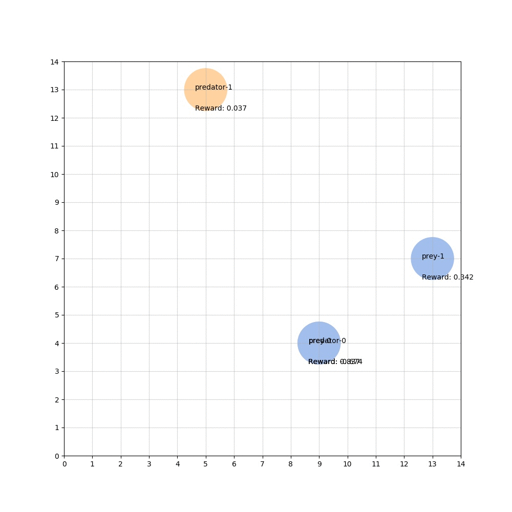
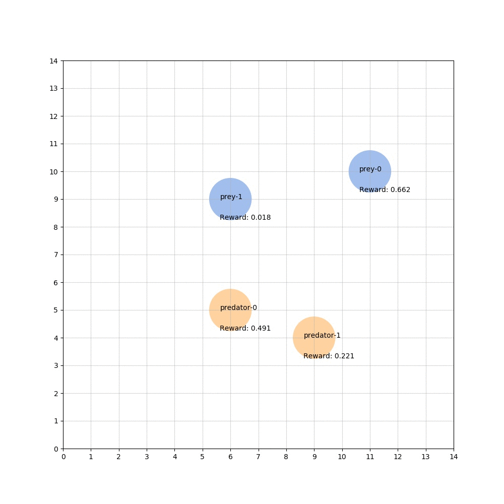
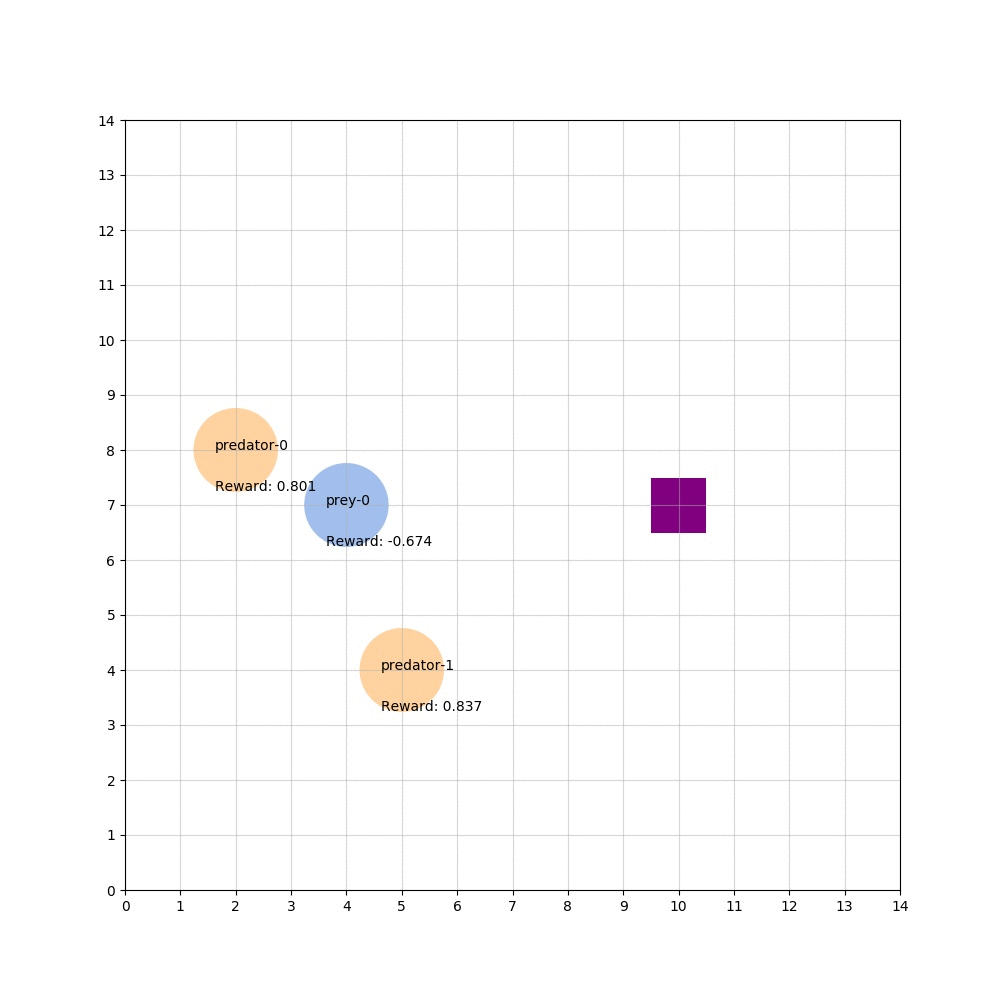

# MARL for patrolling agents

## Examples after 1400 episodes of training

DDQN 2vs2 | MADDPG 2vs2 | DDQN 2v1 Magic Switch
:---------:|:----------:|:-----------:
 |  | 

## Evironment

### Action space
Every agent can do one of `none`, `left`, `right`, `top`, `bottom`.

### State space
The state is complete and everything is known by the agents.

The state is the 3D coordinates (x, y, z) for every agent.

